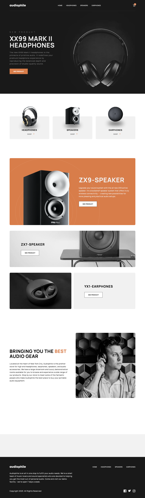

# Frontend Mentor - Audiophile e-commerce website solution

This is a solution to the [Audiophile e-commerce website challenge on Frontend Mentor](https://www.frontendmentor.io/challenges/audiophile-ecommerce-website-C8cuSd_wx). Frontend Mentor challenges help you improve your coding skills by building realistic projects. 

## Table of contents

- [Overview](#overview)
  - [The challenge](#the-challenge)
  - [Screenshot](#screenshot)
  - [Links](#links)
- [My process](#my-process)
  - [Built with](#built-with)
  - [What I learned](#what-i-learned)
  - [Continued development](#continued-development)
  - [Useful resources](#useful-resources)
- [Author](#author)
- [Acknowledgments](#acknowledgments)

**Note: Delete this note and update the table of contents based on what sections you keep.**

## Overview

### The challenge

Users are be able to:

- View the optimal layout for the app depending on their device's screen size ✅
- See hover states for all interactive elements on the page ✅
- Add/Remove products from the cart ✅
- Edit product quantities in the cart ✅
- Fill in all fields in the checkout ✅
- Receive form validations if fields are missed or incorrect during checkout ✅
- See correct checkout totals depending on the products in the cart ✅
  - Shipping always adds $50 to the order ✅
  - VAT is calculated as 20% of the product total, excluding shipping ✅
- See an order confirmation modal after checking out with an order summary ✅
- **Bonus**: Keep track of what's in the cart, even after refreshing the browser (`localStorage` could be used for this if you're not building out a full-stack app) ✅

### Screenshot

### Links

- Solution URL: [https://github.com/benhensor/audiophile.git]
- Live Site URL: [https://fm-audiophile.netlify.app/]

## My process

### Built with

- React
- Semantic HTML5 markup
- CSS variables
- Flexbox
- CSS Grid
- Mobile-first workflow
- [React](https://reactjs.org/) - JS library

### What I learned

With this project, I have learned with deeper clarity the value of careful planning for responsive design. Comparing the high-fidelity design mockups on Figma across the various screen sizes reveals subtle ways in which the elements change orientation or position, making the solution more challenging. Working on a mobile-first approach would often throw up headaches when needing to responsively change the design at larger sizes. Working on this project has given me a greater understanding of this and will be of great benifit to me in the future. 

### Continued development

To go further with this, I would like to incorporate image hosting and make the project full stack to practice handling files from an external server. I would also experiment with alternative ways of styling projects. Up to now I almost always work with adjacent css files imported into my components however, I am aware that there are a myriad of other ways to do this such as styled components for example. A more efficient styling method may be out there, I would like to expand my repertoire of techniques. 

## Author

- Website - Ben Hensor https://benhensordev.netlify.app/
- Frontend Mentor - [@yourusername](https://www.frontendmentor.io/profile/yourusername)
- LinkedIn - Ben Hensor https://linkedin.com/in/benhensor